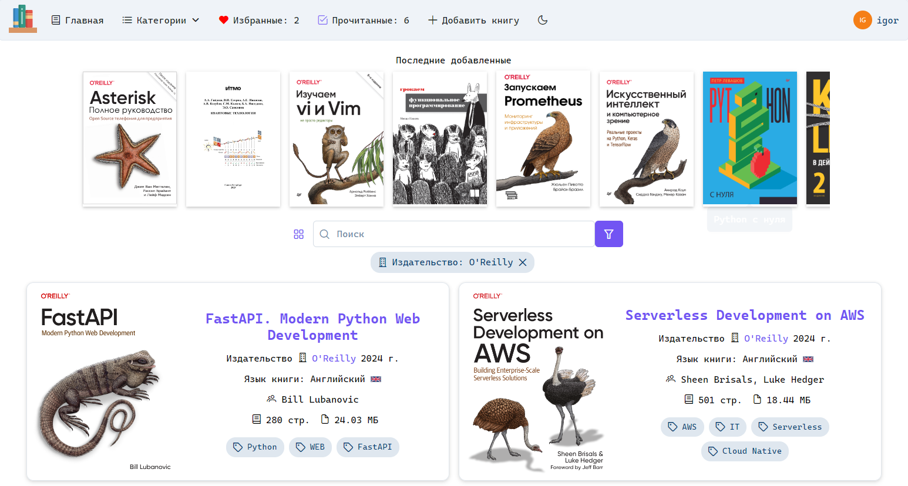

## Bookshelf


[](https://github.com/psf/black)

<div>


</div>

---



---

### Запуск

Переменные окружения:

    DATABASE_URL=   # С асинхронным драйвером

Применение миграций

```shell
alembic upgrade head;
```

Запуск

```shell
uvicorn main:app
```

### Разработка

Миграции для тестовой базы

```shell
export DATABASE_URL=sqlite:///test.db;
alembic upgrade head;
```

Тестирование

```shell
python -m unittest discover tests
```