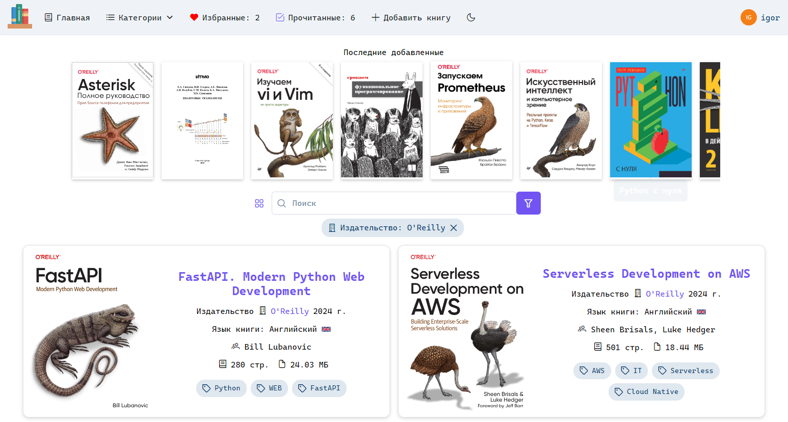

## Bookshelf

Исходный код сайта с книгами для IT специалистов: [it-bookshelf.ru](https://it-bookshelf.ru).


[](https://github.com/psf/black)


---



---

### Запуск

Примеры требуемых переменных окружения сервисов находятся в папке `config/env`.

Для каждого сервиса имеется свой файл с переменными окружения.

Применение миграций

```shell
alembic upgrade head;
```

Запуск

```shell
uvicorn main:app
```

### Разработка

Миграции для тестовой базы

```shell
export DATABASE_URL=sqlite+aiosqlite:///test.db;
alembic upgrade head;
```

Тестирование

```shell
python -m unittest discover tests
```